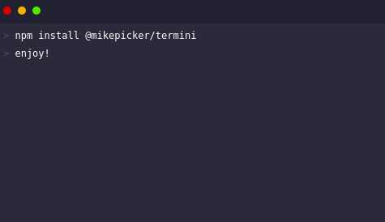

# Termini: no-javascript animated terminal frame for Vue.js



## Project setup
```
npm install @mikepicker/termini
```

Then, import Termini component:
```
<template>
  <div>
    <div style='width: 480px; height: 280px'>
      <Termini v-bind:commands='commands' />
    </div>
  </div>
</template>

<script>
import Termini from '@mikepicker/termini'

export default {
  name: 'HelloWorld',
  data: function () {
    return {
      commands: [
        'npm install @mikepicker/termini',
        'enjoy!'
      ]
    }
  },
  components: {
    Termini
  }
</script>
```
